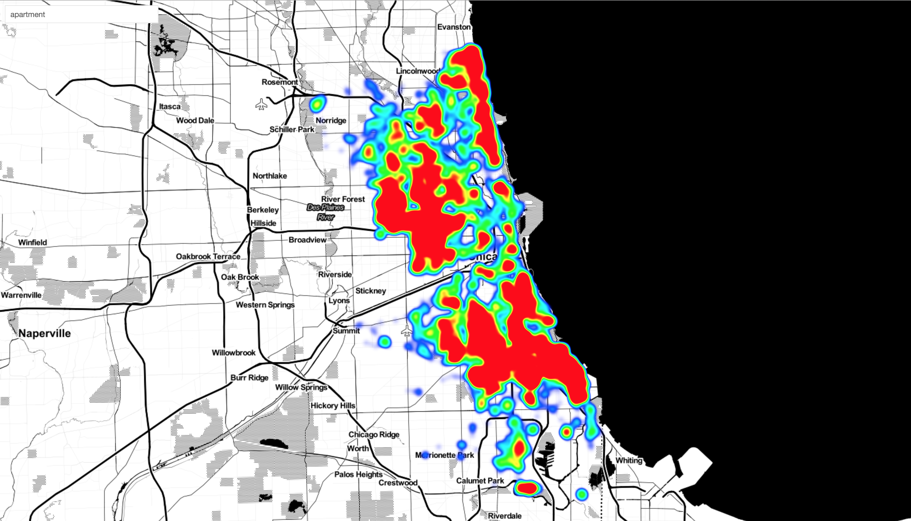

# How to run

```
npm install
npm start
```

You will see a message in the console, like "Server running at ..."
Go to that URL.

You should see this in your browser:



---

# References

The data used in this example is the [Chicago Crimes Dataset](https://data.cityofchicago.org/Public-Safety/Crimes-2001-to-present/ijzp-q8t2). The data included in this repo has been filtered to after 12/01/2015.

[react-map-gl](https://github.com/uber/react-map-gl)

[react-map-gl-heatmap-overlay](https://github.com/vicapow/react-map-gl-heatmap-overlay)


# Resources

- [React getting started](https://facebook.github.io/react/docs/getting-started.html)
- [Redux](http://rackt.org/redux/index.html)
- [Redux Async Actions](http://redux.js.org/docs/advanced/AsyncActions.html)
- [TypeScript Handbook](http://www.typescriptlang.org/Handbook)
- [What is Flux?](http://fluxxor.com/what-is-flux.html)
- [React Redux starter kit](https://github.com/davezuko/react-redux-starter-kit)
