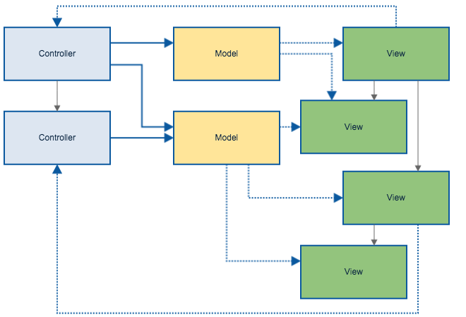

# Intro to Today’s Modern Web Frameworks: React, Typescript, and Redux

---

# Who am I?

- Brie Bunge
- Stanford Alumni
  (BSCS in 2013 and MSCS in 2014, concentration in HCI)
- Frontend Developer at Palantir
  (Joined on Aug 4, 2014)

---

# What are the goals for this session?

- Intro to modern web technologies that we've decided on at Palantir
- Help give clarity in the otherwise perplexing journey of choosing JS frameworks
- A consideration for your next web project
- Overview of the technologies, and reasons why we've chosen them
- See them in action
- Additional resources will be provided for digging deeper

---

# What will be covered?

- Overview of Typescript, React, and Redux
- We will use them in a sample application we build together

---

# What will we be building?


---

# TypeScript

TypeScript is a typed superset of JavaScript that compiles to plain JavaScript, which can run in the browser.

---

```ts
class Greeter {
    greeting: string;
    constructor (message: string) {
        this.greeting = message;
    }
    greet() {
        return "Hello, " + this.greeting;
    }
}
```

```js
var Greeter = (function () {
    function Greeter(message) {
        this.greeting = message;
    }
    Greeter.prototype.greet = function () {
        return "Hello, " + this.greeting;
    };
    return Greeter;
})();
```

---

# Why TypeScript?

- Code navigability
- Compile-time checking of errors (don't need to execute every code path)
- More easily readable when working with others' code
- Refactoring (rather than searching with exclusions)
- Autocomplete support in editors (TypeScript comes with its own language server)

---

# React

A JS library for building user interfaces.

The V in MVC.

---

# Why React?

- Re-render everything mentality
- Declarative
- No extraneous variables just for the purposes of templates
- Fast updates, with minimal mutation of the DOM
- TypeScript and React work well together because you get compile-time props checking

---

# As compared to Backbone


---

# Flux

Flux is an architecture for creating data layers in JavaScript applications. It was designed at Facebook along with the React view library. It places a focus on creating explicit and understandable update paths for your application's data, which makes tracing changes during development simpler and makes bugs easier to track down and fix.

---

# MVC simple


---

# MVC complex



---

# Flux


---

# Redux

- Redux is an implementation of the flux architecture pattern.
- “Love what you’re doing with Redux” - Jing Chen, creator of Flux
- The whole state of your app is stored in an object tree inside a single store.
- The only way to change the state tree is to emit an action, an object describing what happened.
- To specify how the actions transform the state tree, you write pure reducers.

---

# Demo


--- 

# Code & Further Resources

http://bit.ly/palantirinfo

(github was down at the time of this writing, will have it pushed by end of the week)

---

# Thank you!
